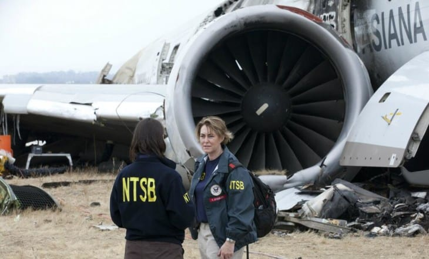
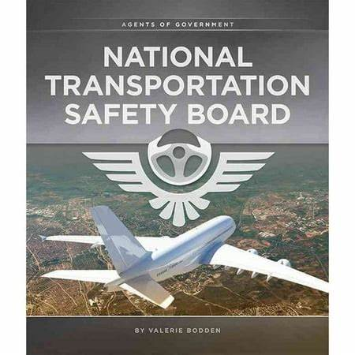

# *AKADEMI EDUCATION – First Cohort (2025): Data Science & AI*
## **First Project: Data Analysis & Engineering - Phase 1**
Student name: Riché FLEURINORD

Student pace: self paced

Deadline Submission: June 8, 2025

Instructors' Names: Wedter JEROME & Geovany Batista Polo LAGUERRE

Blog post URL (GitHub Repository Link): https://github.com/richefleuriord/Fleurinord_Dsc_Aviation_Project.git

# *Project Title*
## **Flight Risk: A Data-Driven Analysis of Aviation Accidents (1962–2023)**

# *Overview*
This data science project analyzes aviation accident data from 1962 to 2023 to support strategic decision-making in the aviation sector. Through data cleaning, exploration, and visualization, the goal is to identify low-risk aircraft models and generate actionable insights for business stakeholdersconsidering investment in aviation.
# *Business Problem*

To support a strategic investment analysis in the aviation sector, I propose to examine historical trends in aviation accidents in order to identify the most reliable aircraft profiles. This approach aims to help a fictional company allocate its resources wisely by minimizing the risks associated with purchasing and operating commercial and private aircraft.

By analyzing accident data collected by the National Transportation Safety Board from 1962 to 2023, I will highlight aircraft models, common causes of incidents, and high-risk contexts. The goal is to produce actionable recommendations to guide the company’s decisions and enhance safety, while ensuring effective cost management and future operations in this new sector.
# *1-Data Understanding*

The dataset used in this project comes from the National Transportation Safety Board (NTSB) and covers aviation events that occurred between 1962 and 2023. It includes both accident and incident investigations, making it a valuable source for analyzing aviation-related risks.

Each event is associated with a unique identifier and contains detailed information such as the date and location of the event, characteristics of the aircraft involved (manufacturer, model, number of engines, engine type), weather conditions, type of flight (commercial, private, etc.), and human consequences (injuries, fatalities).

This initial step aims to:

1- Explore the structure of the dataset,

2- Identify the types of variables available,

3- Detect any missing or inconsistent values,

4- And gain a global understanding of the data to guide the upcoming exploratory analysis and strategic recommendations.
# *Data*
Le jeu de données utilisé dans ce projet provient du National Transportation Safety Board (NTSB) et couvre les accidents aériens survenus aux États-Unis entre 1962 et 2023. Il s'agit de l'une des sources publiques les plus complètes disponibles sur les incidents et accidents d'aviation.

Chaque enregistrement représente un accident ou incident aérien unique, avec des informations sur :

La date et le lieu de l’événement

La marque et le modèle de l’aéronef

Le type de vol (ex. : personnel, commercial, instruction)

La gravité de l’accident (mortel, non mortel, mineur)

Les caractéristiques de l’appareil et du pilote (ex. : aéronef construit par un amateur, type de moteur, etc.)

Le jeu de données a été nettoyé et prétraité afin d’éliminer les valeurs manquantes ou non pertinentes. Il constitue la base de l’analyse des risques et de la stratégie d’investissement développées dans le cadre de ce projet.
# *Methods*
This project relies on descriptive analysis, including the examination of trends over time. This approach provides a clear overview of aviation accident dynamics in the United States, helping to identify the most frequent aircraft models, flight types, and human-related factors involved in incidents.

The goal is to deliver insightful indicators for decision-making, aimed at effectively guiding an investment strategy in the aviation sector.
# *Results*
Most aviation accidents involve personal flights, and light aircraft models like Cessna and Piper dominate the records. While these models appear frequently in accident reports, the severity of accidents involving them is generally lower compared to lesser-known manufacturers. Moreover, amateur-built aircraft, though representing a smaller share of incidents, show noteworthy involvement and warrant special attention.

The total number of aviation accidents tends to peak around July and August, a period that corresponds to increased flight activity in the United States, notably due to summer vacations and favorable weather conditions. In contrast, a noticeable drop is observed in January, which is typically a quieter period for private or recreational flights.

 
# *Conclusions*
As part of this strategic analysis aimed at supporting an investment decision in the aviation sector, we conducted an in-depth study of aviation accident data in the United States over a period of more than 60 years (1962–2023), provided by the National Transportation Safety Board (NTSB). The primary objective was to address a concrete risk management need: to identify the most reliable aircraft profiles in order to intelligently guide the purchase, operation, and deployment choices of a fictional company seeking to enter this market.

Our methodical approach was based on a combination of categorical and quantitative analyses structured around several key areas. First, the analysis of operator types revealed that over 80% of accidents are concentrated in general aviation a segment where regulatory oversight and training vary significantly. In contrast, commercial and charter operations, which are more strictly supervised, present a reduced risk, making them particularly attractive for a cautious market entry strategy.

Second, the component focused on aircraft models provided essential insights. While Cessna and Piper models appear frequently in accident databases in absolute terms, this must be interpreted in the context of their widespread use and longevity on the market. Through a risk-scoring approach per incident, we demonstrated that these two manufacturers actually offer a moderate risk profile, supported by excellent technical documentation, a solid spare parts network, and compatibility with reliable maintenance programs. Therefore, investing in recent, well maintained Cessna or Piper models appears to be a rational decision, combining operational reliability, cost accessibility, and risk control.

Conversely, aircraft from small or lesser-known manufacturers despite appearing less frequently in accident statistics show higher severity scores and sometimes lower safety standards. This asymmetry highlights that the rarity of an accident does not necessarily equate to aircraft safety, especially in the absence of a rich historical dataset.

Third, the geographic study revealed high-incident areas particularly Alaska, California, and Texas which should be taken into account when planning air bases and flight routes. At the same time, our temporal analysis showed that technological and regulatory advances since the 2000s have led to a continuous reduction in the number of incidents, offering a window of opportunity to invest in modern fleets equipped with automated systems and predictive maintenance mechanisms.

Finally, our analyses converge toward a clear strategic recommendation: to maximize safety while minimizing costs and exposure to risk, it is advisable to focus on certified, well documented, and historically reliable aircraft especially those from Cessna and Piper. Far from being simple observations, these conclusions form a solid foundation for decision-making, enabling the company to enter the aviation sector with clarity, pragmatism, and ambition.
# *Next steps* 
1- Assessment of the financial and operational feasibility of the recommendedaircraft.

2- Integration of complementary data (costs, profitability, technical performance).

3-Development of a dynamic decision-support tool (dashboard) for real-time monitoring.

4-Implementation plan for recommendations: acquisition, training, safety audit, etc
# *For More Information*
For additional info, contact Riche Fleurinord at richefleurinord20@gmail.com

# *Repository Structure*
1-.ipynb_checkpoints

2-Data

3-Final_files

4-images

5-Final.ipynb

6-Final.Presentation.pdf

7-Final.md

